# 🍗 YKOS BBQ Chicken – Good Chicken, Fast Delivery

**Dein direkter Weg zu frischem, leckerem Essen – schnell, einfach und modern.**

YKOS BBQ Chicken ist die offizielle Liefer- und Bestell-App von **YKO’S**, die dir ermöglicht, deine Lieblingsgerichte bequem online zu bestellen – ob für **Lieferung nach Hause** oder **Selbstabholung**.  
Neben den beliebten Chicken-Gerichten bietet YKOS jetzt auch **neue Speisen wie Pizzen, Pasta und mehr** an.  

Das Herzstück der App ist die **Echtzeit-Verbindung** zur internen **Ykos Kitchen App**:  
Sobald du bestellst, erscheint deine Bestellung in der Küchenanwendung, wo das Team deine Order live verwaltet, Zeiten aktualisiert und dir den **aktuellen Status** übermittelt – alles **in Echtzeit** mit einem **Countdown-Timer**, damit du immer weißt, wann dein Essen fertig oder auf dem Weg ist.

---

## 🍔 Features

- [x] **Echtzeit-Bestellstatus** – Dank direkter Verbindung zur YKOS Kitchen App.  
- [x] **Lieferung oder Abholung** – Wähle flexibel deinen bevorzugten Bestellmodus.  
- [x] **Timer-Tracking** – Verfolge den Fortschritt deiner Bestellung live.  
- [x] **Login & Registrierung** – Persönliche oder geschäftliche Adressen sicher speichern.  
- [x] **Favoriten-System** – Lieblingsgerichte mit einem Klick speichern.  
- [x] **Vorbestellungen** – Plane Bestellungen im Voraus für bestimmte Tage oder Zeiten.  
- [x] **Animierte Benutzeroberfläche** – Angenehme UI mit Lottie-Animationen und modernen Designs.  

---

## 🔧 Technischer Aufbau

Das Projekt wurde mit **Flutter** entwickelt und folgt dem **MVVM-Prinzip (Model-View-ViewModel)** mit **Provider** als State-Management-Lösung.  
Für Authentifizierung und Datenspeicherung wird **Firebase** verwendet.

### 📁 Struktur

**• Models:**  
Enthalten alle Datenstrukturen (z. B. Bestellung, Benutzer, Menüartikel) und kommunizieren mit Firestore.

**• ViewModels:**  
Steuern die Logik zwischen Firestore, Authentifizierung und der UI.  
Nutzen das Provider-Paket für reaktives State-Management und Echtzeit-Updates.

**• Views (Pages):**  
Flutter-Widgets, die die Benutzeroberfläche darstellen.  
Jede View ist minimalistisch, performant und verwendet Animationen für ein modernes Nutzererlebnis.

**• Services:**  
Abstraktionsschicht zur Firebase-Kommunikation (Auth, Firestore).  
Beispiele:  
- `FireAuth` → Login, Registrierung, Passwort-Reset  
- `ViewmodelOrders` → Bestellverarbeitung & Timer-Tracking  
- `ViewmodelMenu` → Menüverwaltung  

---

## ☁️ Firebase Integration

### Verwendete Firebase-Services

- **Firebase Authentication**  
  Für Login, Registrierung und Passwort-Zurücksetzen per E-Mail.  

- **Cloud Firestore**  
  Speicherung aller Bestellungen, Benutzerinformationen und Menüartikel.  
  Dank **Echtzeit-Listener** wird der Bestellstatus automatisch aktualisiert.  

### Vorteile:

✅ **Echtzeit-Synchronisierung** zwischen Kunden- und Küchen-App  
✅ **Offline-Fähigkeit** durch lokale Zwischenspeicherung  
✅ **Sichere Authentifizierung** über FirebaseAuth  

---

## 🔁 Verbindung zur YKOS Kitchen App

Die YKOS BBQ Chicken App ist direkt mit der **Ykos Kitchen App** verbunden.  
Bestellungen erscheinen automatisch im Küchen-Dashboard, wo Mitarbeiter:  
- den Bestellstatus ändern (z. B. „in Bearbeitung“, „unterwegs“, „fertig“),  
- Liefer- und Abholzeiten anpassen,  
- den Fortschritt live zurück an die Kunden-App übermitteln.  

Der Kunde sieht diese Änderungen in **Echtzeit** über einen **visuellen Timer** in der App.

---

## 🧪 Tests & Stabilität

Das System wurde mit Unit- und Integrationstests auf Zuverlässigkeit geprüft.  
Besonderes Augenmerk liegt auf:
- der korrekten Synchronisation zwischen Firestore und den ViewModels,  
- der Stabilität der Authentifizierung,  
- der Handhabung von Offline-Szenarien.  

---

## 🚀 Ausblick

- [ ] Integration von **Online-Zahlungsmethoden** (PayPal, Apple Pay, Google Pay)  
- [ ] Erweiterte **Push-Benachrichtigungen** für Status-Updates  
- [ ] **Live-Tracking für Lieferfahrer**  
- [ ] **Rabatt- & Bonusprogramme** für wiederkehrende Kunden  
- [ ] **Mehrsprachigkeit** (Deutsch / Englisch / Türkisch)  
- [ ] **Kundensupport-Chat** direkt in der App  

---

## 📱 Screenshots & Animationen

 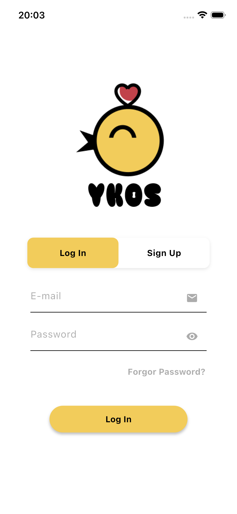 
 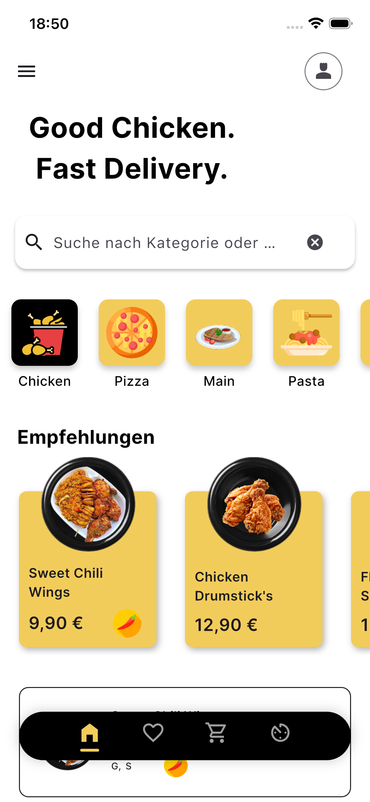 
 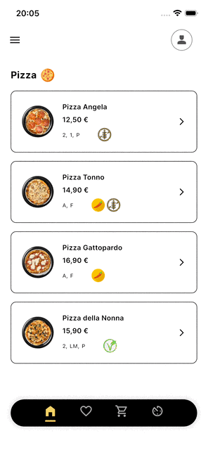 
 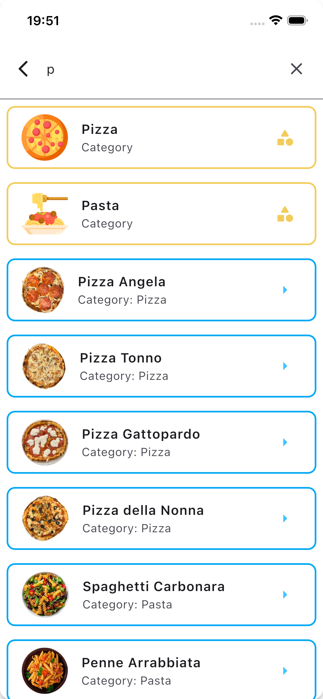 
  
 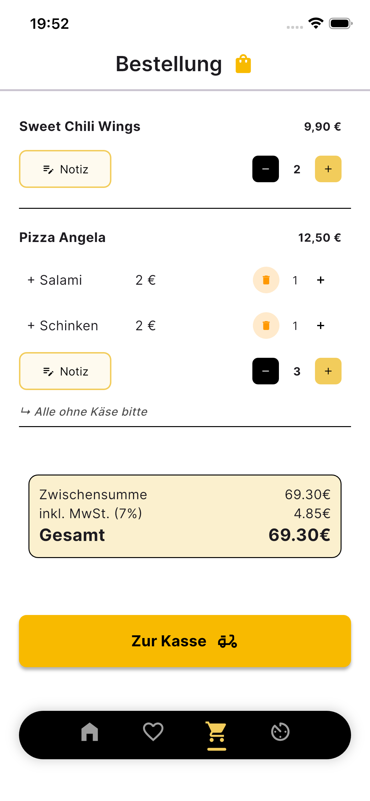 
 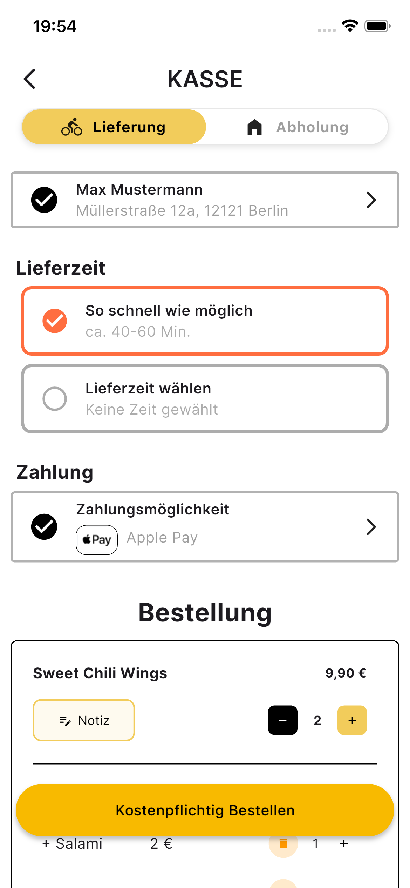
 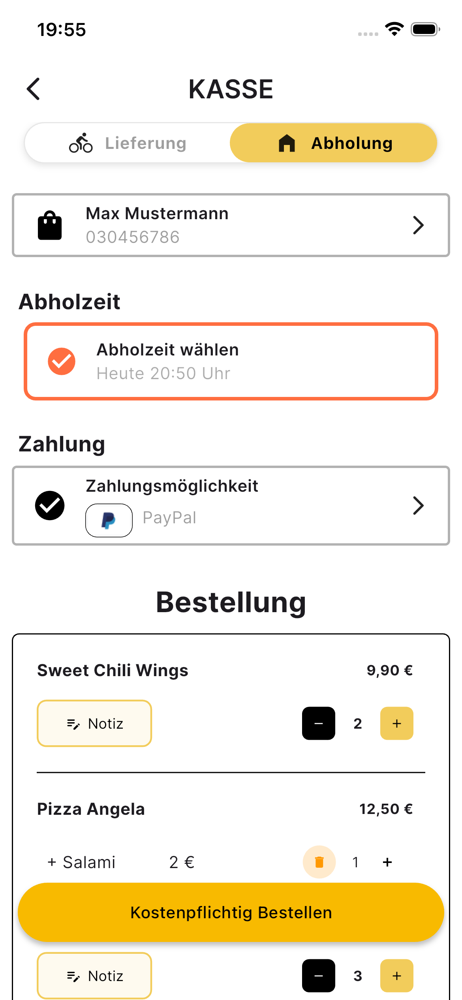 
  
 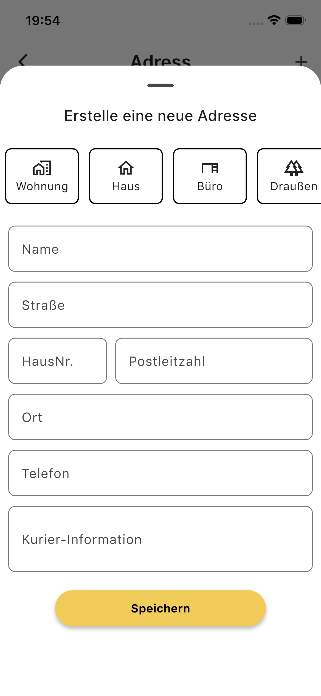 
 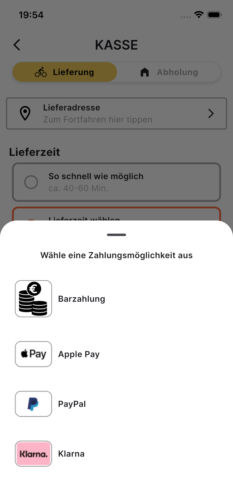 
 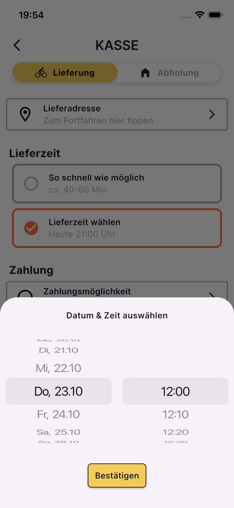 
  
 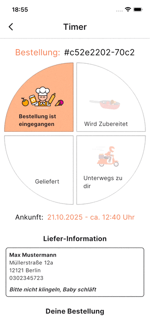 
 
 
 
  

---

## 🧩 Verwendete Packages & Frameworks

| Technologie | Beschreibung |
|--------------|---------------|
| **Flutter** | UI-Framework für Android & iOS |
| **Provider** | State-Management für MVVM-Struktur |
| **FirebaseAuth** | Authentifizierungssystem |
| **Cloud Firestore** | Echtzeit-Datenbank |
| **Lottie** | Animierte Benutzeroberflächen |
| **Google Fonts** | Typografie & Design |
| **Animated SnackBar** | Benutzerfreundliche Benachrichtigungen |
| **Logger** | Debugging und Logging |
| **UUID** | Eindeutige IDs für Bestellungen & Nutzer |

---

### 🏗️ Architektur-Zusammenfassung

| Ordner / Datei | Beschreibung |
|----------------|---------------|
| 📂 `model/` | Datenmodelle (Order, User, MenuItem) |
| 📂 `viewmodel/` | Business-Logik & State (Provider) |
| 📂 `service/` | Firebase Services (Auth, Firestore) |
| 📂 `Pages/` | UI-Ansichten (Login, Menu, Checkout, Timer etc.) |
| 📂 `navigation/` | Navigation & BottomNav |
| 📂 `Error/` | Zentrale Fehlerbehandlung |
| 📄 `main.dart` | Einstiegspunkt der App |

---

## ❤️ Fazit

**YKOS BBQ Chicken** vereint modernes App-Design mit echter Funktionalität.  
Kunden bestellen mit nur wenigen Klicks, während die Küche live reagiert – alles nahtlos verbunden über Firebase.  
Schnell, transparent und zuverlässig – **Good Chicken, Fast Delivery.**
