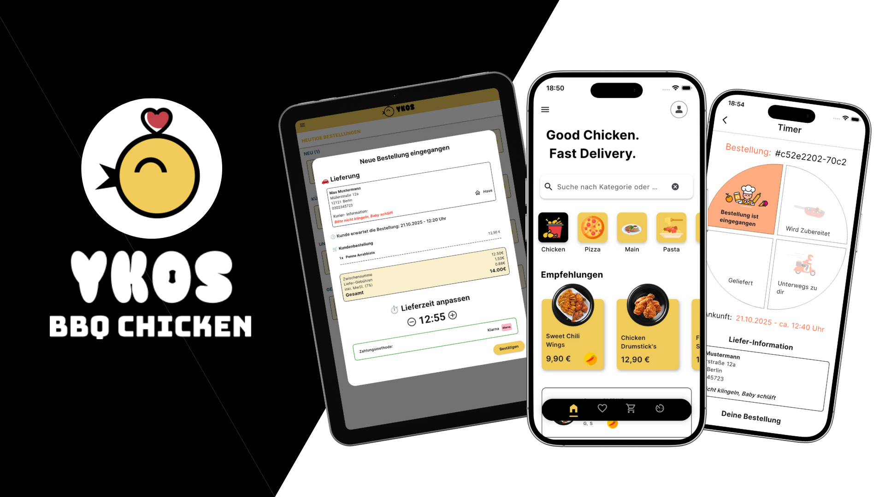

  

---

# 🍗 YKOS BBQ Chicken – Good Chicken, Fast Delivery

**Your direct way to fresh, delicious food – fast, easy, and modern.**

YKOS BBQ Chicken is the official delivery and ordering app from **YKO’S**, allowing you to conveniently order your favorite dishes online – for **home delivery** or **pickup**.  
In addition to the popular chicken dishes, YKOS now also offers **new meals such as pizzas, pasta, and more**.  

The heart of the app is the **real-time connection** to the internal **Ykos Kitchen App**:  
As soon as you place an order, it appears in the kitchen application, where the team manages your order live, updates times, and sends you the **current status** – all **in real time** with a **countdown timer**, so you always know when your food is ready or on the way.

---

## 🍔 Features

- [x] **Real-time order status** – Thanks to direct connection with the YKOS Kitchen App.  
- [x] **Delivery or pickup** – Choose your preferred ordering mode flexibly.  
- [x] **Timer tracking** – Track your order’s progress live.  
- [x] **Login & registration** – Safely store personal or business addresses.  
- [x] **Favorites system** – Save your favorite dishes with one click.  
- [x] **Pre-orders** – Schedule orders in advance for specific days or times.  
- [x] **Animated user interface** – Pleasant UI with Lottie animations and modern design.  

---

## 🔧 Technical Setup

The project was developed with **Flutter** and follows the **MVVM principle (Model-View-ViewModel)** using **Provider** as a state management solution.  
**Firebase** is used for authentication and data storage.

### 📁 Structure

**• Models:**  
Contain all data structures (e.g., order, user, menu item) and communicate with Firestore.

**• ViewModels:**  
Control the logic between Firestore, authentication, and the UI.  
Use the Provider package for reactive state management and real-time updates.

**• Views (Pages):**  
Flutter widgets that represent the user interface.  
Each view is minimalist, high-performing, and uses animations for a modern user experience.

**• Services:**  
Abstraction layer for Firebase communication (Auth, Firestore).  
Examples:  
- `FireAuth` → Login, registration, password reset  
- `ViewmodelOrders` → Order processing & timer tracking  
- `ViewmodelMenu` → Menu management  

---

## ☁️ Firebase Integration

### Firebase Services Used

- **Firebase Authentication**  
  For login, registration, and password reset via email.  

- **Cloud Firestore**  
  Stores all orders, user information, and menu items.  
  Thanks to **real-time listeners**, the order status is automatically updated.  

### Advantages:

✅ **Real-time synchronization** between customer and kitchen app  
✅ **Offline capability** through local caching  
✅ **Secure authentication** via FirebaseAuth  

---

## 🔁 Connection to the YKOS Kitchen App

The YKOS BBQ Chicken App is directly connected to the **Ykos Kitchen App**.  
Orders automatically appear in the kitchen dashboard, where employees can:  
- change the order status (e.g., “in progress,” “on the way,” “ready”),  
- adjust delivery and pickup times,  
- send progress updates back to the customer app live.  

Customers see these changes **in real time** through a **visual timer** in the app.

---

## 📱 Screenshots & Animations

  
  
  
  
  
  
 
  
  
  
  
  
  
  

---

## 🧪 Testing & Stability

The system has been tested for reliability with unit and integration tests.  
Special focus is placed on:
- correct synchronization between Firestore and ViewModels,  
- stable authentication,  
- handling of offline scenarios.  

---

## 🚀 Outlook

- [ ] Integration of **online payment methods** (PayPal, Apple Pay, Google Pay)  
- [ ] Extended **push notifications** for status updates  
- [ ] **Live tracking for delivery drivers**  
- [ ] **Discount & bonus programs** for returning customers  
- [ ] **Multilingual support** (German / English / Italian)  
- [ ] **Customer support chat** directly in the app  

---

## 🧩 Used Packages & Frameworks

| Technology | Description |
|-------------|--------------|
| **Flutter** | UI framework for Android & iOS |
| **Provider** | State management for MVVM structure |
| **FirebaseAuth** | Authentication system |
| **Cloud Firestore** | Real-time database |
| **Lottie** | Animated user interfaces |
| **Google Fonts** | Typography & design |
| **Animated SnackBar** | User-friendly notifications |
| **Logger** | Debugging and logging |
| **UUID** | Unique IDs for orders & users |

---

### 🏗️ Architecture Summary

| Folder / File | Description |
|----------------|--------------|
| 📂 `model/` | Data models (Order, User, MenuItem) |
| 📂 `viewmodel/` | Business logic & state (Provider) |
| 📂 `service/` | Firebase services (Auth, Firestore) |
| 📂 `Pages/` | UI views (Login, Menu, Checkout, Timer, etc.) |
| 📂 `navigation/` | Navigation & BottomNav |
| 📂 `Error/` | Central error handling |
| 📄 `main.dart` | App entry point |

---

## ❤️ Conclusion

**YKOS BBQ Chicken** combines modern app design with real functionality.  
Customers can order with just a few clicks, while the kitchen reacts live – all seamlessly connected through Firebase.  
Fast, transparent, and reliable – **Good Chicken, Fast Delivery.**

Design inspiration: Jewel Thompson-Adiuku
